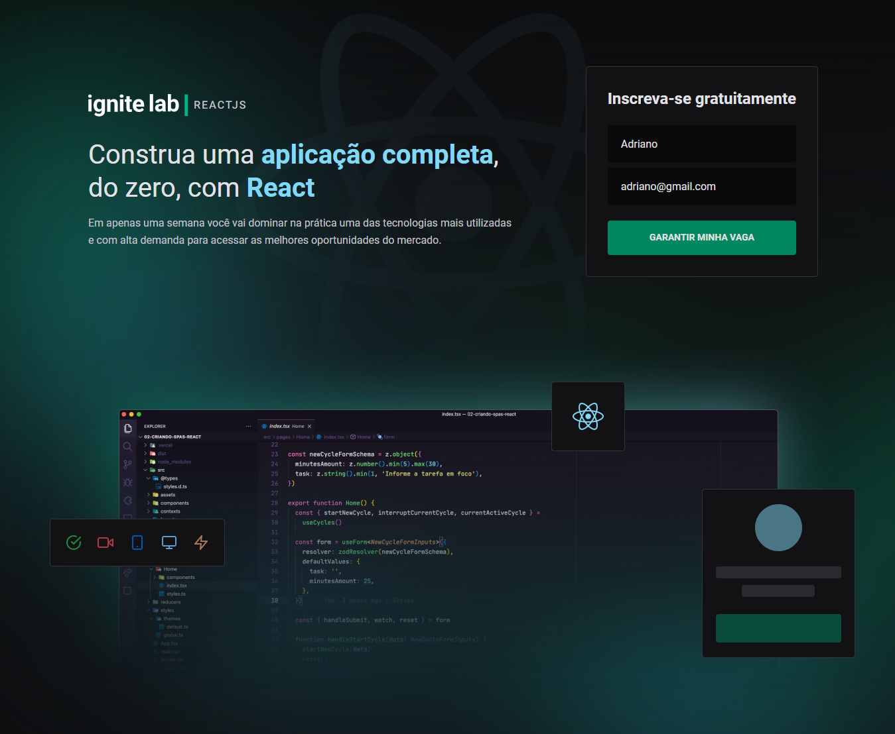
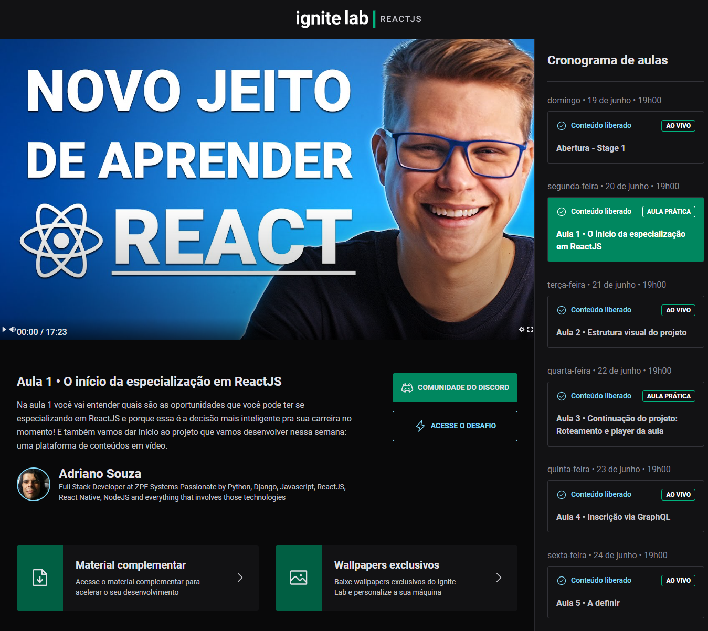

# ignite-lab-platform
This is an application which simulates a EDtech platform

## Main Technologies used

### FRONT-END
-   [Vite](https://vitejs.dev/guide/)
-   [ReactJS](https://reactjs.org/)
-   [TypeScript](https://www.typescriptlang.org/pt/docs/handbook/react.html)
-   [Tailwind](https://tailwindcss.com/)
-   [GraphCMS](https://hygraph.com/)
-   [GraphQL](https://www.apollographql.com/docs/react/)
-   [Apollo Client](https://www.apollographql.com/docs/react/)
-   [React-Toastify](https://fkhadra.github.io/react-toastify/)

#   